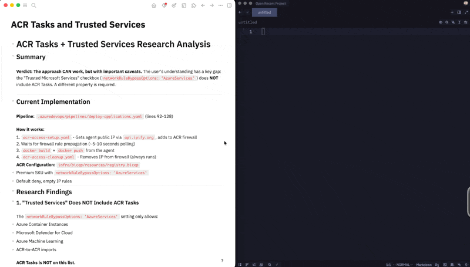
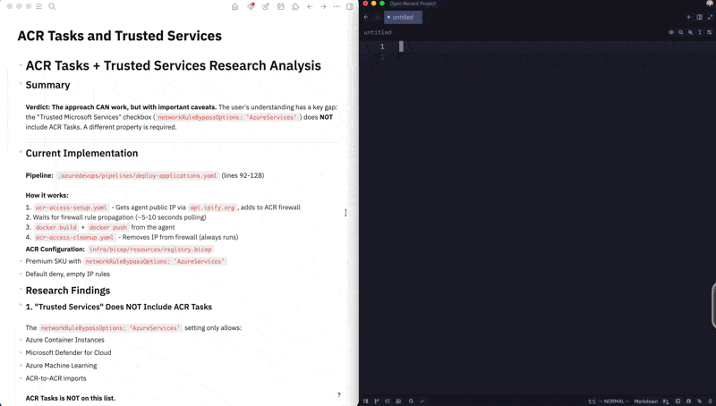

# Rip Bullet Points

A Logseq plugin that converts pages to clean markdown by removing bullet points and Logseq-specific syntax. Perfect for extracting content for blog posts, documentation, or sharing outside of Logseq.

## Features

- **Removes top-level bullets** - Converts to paragraphs for cleaner prose
- **Preserves nested bullets** - Keeps them as standard markdown lists
- **Preserves formatting** - Code fences, tables, and horizontal rules stay intact
- **Cleans Logseq syntax** - Converts `[[page links]]` to plain text, removes `{{embeds}}` and `#tags`
- **One-click copy** - Results copied directly to clipboard

## Installation

### From Source (Developer Mode)

1. Clone this repository
2. Run `npm install && npm run build`
3. In Logseq, enable **Developer mode** (Settings → Advanced → Developer mode)
4. Go to Plugins → Load unpacked plugin
5. Select the repository folder

## Usage

Two ways to use:

1. **Slash command**: Type `/clean-markdown` in any block
2. **Context menu**: Right-click on the page title → "Copy as Clean Markdown"

## Example

### Standard Export of Logseq



### Clean Markdown export through Plugin



## Development

```bash
# Install dependencies
npm install

# Build plugin
npm run build

# Watch mode (rebuild on changes)
npm run dev
```

## License

MIT
